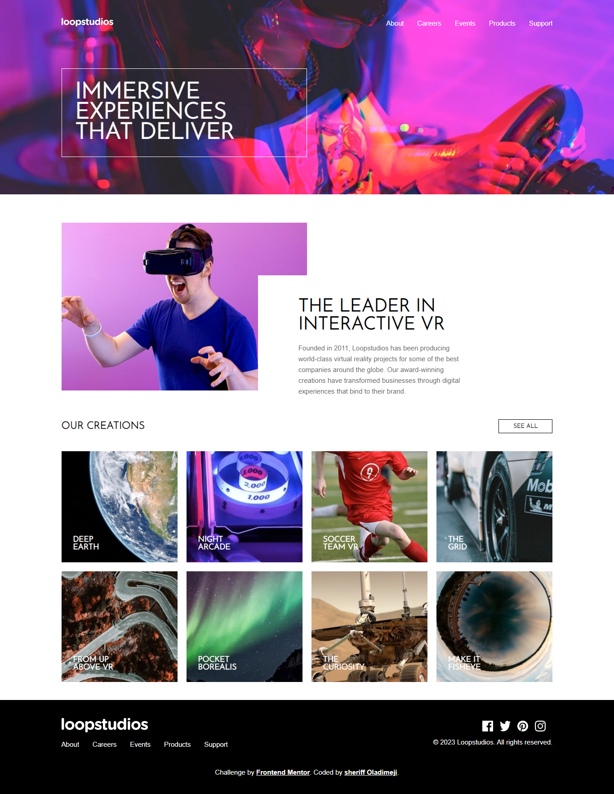

# Frontend Mentor - Loopstudios landing page solution

This is a solution to the [Loopstudios landing page challenge on Frontend Mentor](https://www.frontendmentor.io/challenges/loopstudios-landing-page-N88J5Onjw). Frontend Mentor challenges help you improve your coding skills by building realistic projects. 
## Table of contents

- [Overview](#overview)
- [Screenshot](#screenshot)
- [Links](#links)
- [Built with](#built-with)
- [Author](#author)

## Overview

### Screenshot
desktop

mobile

### Built with

- Semantic HTML5 markup
- CSS custom properties
- Flexbox
- CSS Grid
- Desktop-first workflow

## Author

- Website - [Github](https://github.com/Sheriff-Oladimeji)
- Frontend Mentor - [@OladimejiSheriff](https://www.frontendmentor.io/profile/OladimejiSheriff)
- Twitter - [@sheriffWebDev](https://www.twitter.com/sheriffWebDev)

### Links

- Solution URL: [View solution](https://github.com/Sheriff-Oladimeji/loopstudios-landing-page-main)
- Live Site URL: [Vist site](https://loopstudios-landing-page-main-lyart.vercel.app/)